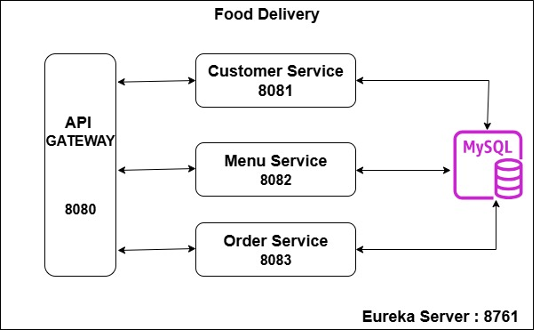
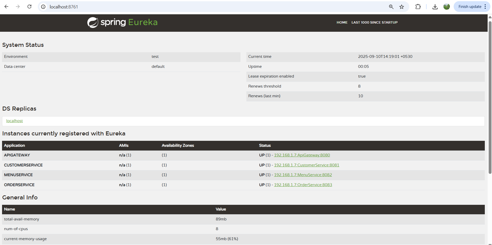
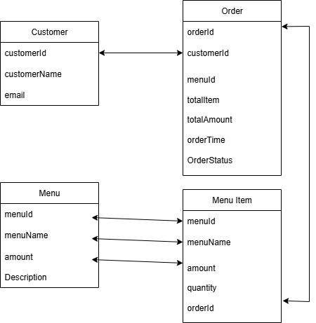

# Food Delivery - Customer Service

## 📌 Overview
The **Food Delivery Application** is a microservices-based system designed to handle customer management, menu operations, and order processing.  
This repository contains the **Customer Service** which manages customer-related operations.

  
*High-Level Design of Food Delivery Application*

  
*Eureka Server*

  
*Database Schema*

---

## 🚀 Service Details
This is the **Customer Service** for the Food Delivery application.  
- Manages **customer registration**.  
- Provides **CRUD operations** on customer data.  
- Works with **Eureka Service Registry** and **API Gateway**. 
---

## 🔗 Other Services
- [API Gateway](https://github.com/saurabhkumarr99/FoodDelivery-ApiGateway)  : Acts as the single entry point for all client requests.
- [Customer Service](https://github.com/saurabhkumarr99/FoodDelivery-CustomerService) : manages customer-related operations.
- [Menu Service](https://github.com/saurabhkumarr99/FoodDelivery-MenuService)  :  Manages menu items for restaurants
- [Order Service](https://github.com/saurabhkumarr99/FoodDelivery-OrderService)  : handles all order-related operations.

---

## ⚙️ Setup Instructions
1. Setup **MySQL Database**  
   ```sql
   CREATE DATABASE FoodDelivery;
2. Git clone all services
3. Download Dependencies
4. Start Application

---
## Author - [Saurabh Kumar Rai](https://www.linkedin.com/in/saurabh-kumar-rai-36531a222/)
